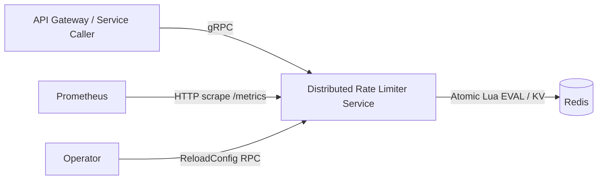
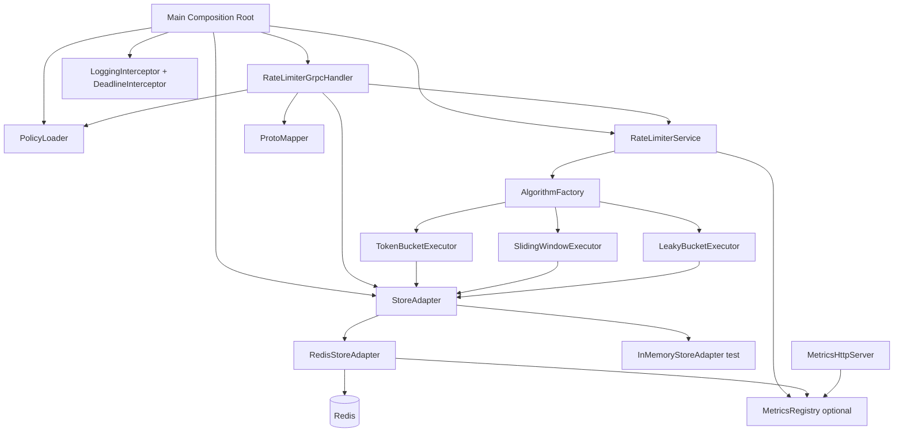
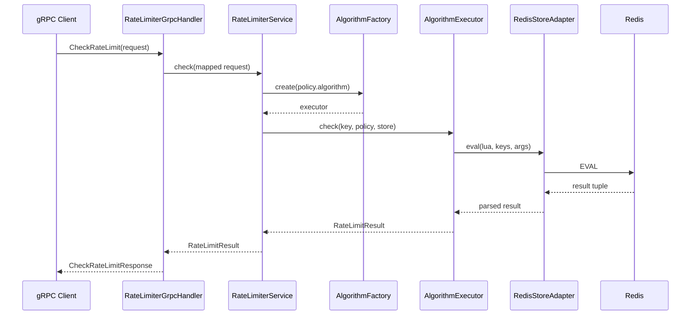
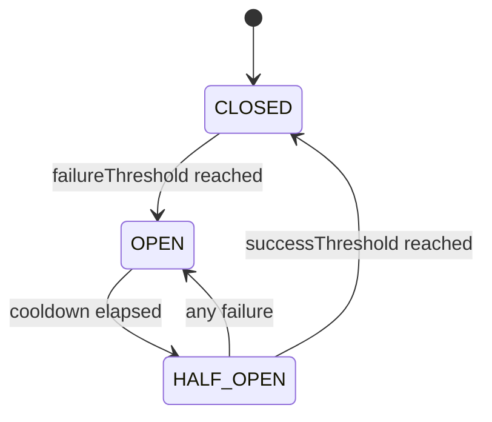

# Distributed Rate Limiter - Design Document

## 1. Overview

This service is a standalone Java 21 gRPC rate limiter that enforces distributed limits using Redis as shared state.
It supports three algorithms:
- Token Bucket
- Sliding Window
- Leaky Bucket

It is designed to:
- Provide atomic, race-safe decisions across multiple service instances
- Support runtime policy reload without restart
- Offer observability via metrics and structured logs
- Handle datastore failures via fail-open/fail-closed and circuit breaker patterns

## 2. System Context

## 3. High-Level Architecture

## 4. Core Design Decisions

- Language/runtime: Java 21 with preview features enabled.
- Transport/API: gRPC + protobuf contract (`ratelimiter.v1`).
- Data store: Redis via Lettuce; atomic script execution with `EVAL`.
- Concurrency model: virtual threads in server execution and selected async wrapping.
- Algorithm modularity: `AlgorithmExecutor` interface with factory-driven selection.
- Policy management: YAML-backed loader with validation + atomic map swap on reload.

## 5. Request Processing Flow

## 6. API Contract

Implemented RPCs:
- `CheckRateLimit`
- `ReloadConfig`
- `HealthCheck`

Error mapping:
- `PolicyNotFoundException` -> `NOT_FOUND`
- `ConfigValidationException` -> `INVALID_ARGUMENT`
- `RateLimiterUnavailableException` -> `UNAVAILABLE`
- Deadline interceptor pre-check -> `DEADLINE_EXCEEDED`

Mapping boundary:
- `ProtoMapper` converts proto <-> internal model.
- Business logic remains protobuf-decoupled.

## 7. Domain Model

Internal model includes:
- `Algorithm` (`TOKEN_BUCKET`, `SLIDING_WINDOW`, `LEAKY_BUCKET`)
- `FailMode` (`OPEN`, `CLOSED`)
- `RateLimitPolicy` (record with safe defaults)
- `RateLimitRequest` / `RateLimitResult`
- `Errors` namespace for typed runtime exceptions

## 8. Policy Management

`PolicyLoader` responsibilities:
- Load `config/policies.yaml` at startup.
- Validate policy set with aggregated errors (no fail-fast).
- Enforce uniqueness and per-algorithm required fields.
- Expose `getPolicy(id)` and `reload(newPolicies)`.
- `reload` performs validation first, then atomic `volatile` map replacement.

Concurrency property:
- Readers always observe a fully-initialized map; no partial/null snapshots.

## 9. Algorithm Implementations

### 9.1 Token Bucket
- Redis key pattern: `rl:tb:{policyId}:{key}`
- Lua script tracks `tokens` and `lastRefill` atomically.
- Returns allow/deny, remaining, reset metadata.
- TTL derived from capacity/refill to allow natural cleanup.

### 9.2 Sliding Window
- Redis key pattern: `rl:sw:{policyId}:{key}`
- Lua script removes stale timestamps and checks current cardinality atomically.
- Enforces strict rolling-window behavior.

### 9.3 Leaky Bucket
- Redis key pattern: `rl:lb:{policyId}:{key}`
- Implemented as token-bucket delegation with leak-rate semantics.
- Retry-after adjusted for leak dynamics.

## 10. Store Abstraction

`StoreAdapter` operations:
- `get`, `set`, `eval`, `ping`, `close`

Implementations:
- `RedisStoreAdapter` (production): wraps async Lettuce calls with virtual-thread scoped execution and error normalization.
- `InMemoryStoreAdapter` (tests): deterministic script-name dispatch simulation for algorithm testing.

## 11. Observability

### 11.1 Metrics
`MetricsRegistry` records:
- `drl.requests.total` (tags: algorithm, policy_id, result)
- `drl.store.latency` (operation)
- `drl.store.errors.total` (operation)
- `drl.bucket.fill.ratio` (policy_id)

`MetricsHttpServer` endpoints:
- `GET /metrics` (Prometheus format)
- `GET /healthz` (`{"status":"ok"}`)

### 11.2 Structured Logging
- Logback JSON encoder configured (`logback.xml`).
- `RateLimiterGrpcHandler` emits structured decision logs with:
  - request context (`policyId`, `key`, `path`, `method`)
  - result fields (`allowed`, `limit`, `remaining`, `resetAt`, `retryAfter` when throttled)
  - `latencyMs`
- Test logging muted via `logback-test.xml`.

## 12. Resilience

### 12.1 Fail Mode
`RateLimiterService` behavior on store failures:
- `OPEN`: allow request with degraded marker (`remaining=-1`)
- `CLOSED`: throw `RateLimiterUnavailableException`

### 12.2 Circuit Breaker
`CircuitBreakerStoreAdapter` wraps any `StoreAdapter`.

Implementation details:
- Atomic state/counters (`AtomicReference`, `AtomicInteger`, `AtomicLong`)
- Clock injection (`LongSupplier`) for deterministic tests
- Open state short-circuits with immediate `StoreException`

### 12.3 Deadline Enforcement
`DeadlineInterceptor`:
- Allows calls with no deadline.
- Rejects expired or low-budget (<5ms) calls immediately with `DEADLINE_EXCEEDED`.
- Logs deadline-exceeded events with method/peer context.

## 13. Bootstrap and Runtime Wiring

`Main` composes:
- `RedisStoreAdapter`
- `PolicyLoader`
- `RateLimiterService`
- `RateLimiterGrpcHandler`
- gRPC server with virtual-thread executor and interceptors
- graceful shutdown hook for server/store/executor

Environment variables:
- `REDIS_URI` (default `redis://localhost:6379`)
- `GRPC_PORT` (default `50051`)
- `METRICS_PORT` (default `9090`)
- `FAIL_MODE` (default `OPEN`)

## 14. Deployment and Packaging

Artifacts and runtime assets:
- Fat JAR via Shadow plugin.
- Multi-stage Docker image (`Dockerfile`).
- Local composition with Redis (`docker-compose.yml`).
- Test compose for Redis-only scenarios (`docker-compose.test.yml`).

## 15. Testing Strategy

### 15.1 Unit Tests
Coverage includes:
- model correctness and exceptions
- store adapters and virtual-thread behavior
- algorithm correctness (allow/deny/retry/refill/window semantics)
- factory and core service fail modes
- proto mapping and gRPC handler status mapping
- metrics, logging behavior integration points
- circuit breaker and deadline interceptor transitions
- server smoke checks and virtual-thread assertion

### 15.2 Integration Tests
Configured separate Gradle task/source set:
- `integrationTest` task
- `test` excludes `integration` package

Integration suite uses Testcontainers Redis and validates:
- concurrent token bucket admission cap
- sliding-window reopen behavior
- leaky-bucket rate enforcement
- end-to-end gRPC endpoint behavior including reload

## 16. CI Pipeline

GitHub Actions jobs:
- `test`: runs `./gradlew test`
- `integration`: runs `./gradlew integrationTest` after `test`

## 17. Known Gaps / Next Iterations

- Full runtime validation of Docker health-probe behavior requires executing compose in CI/runtime environment.
- Additional performance/load benchmarking is not yet included.
- Metrics cardinality controls and log sampling are future hardening options.
